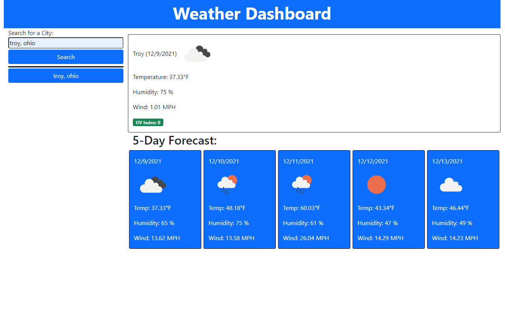

 </a>

<h3 align="center">Weather Dashboard</h3>

---

Visit the deployed project at:
<a href="https://github.com/glenluersman/weather-dashboard">https://github.com/glenluersman/weather-dashboard</a>
      

## 

- [About](#about)
- [Built With](#built_using)
- [Authors](#authors)
- [Questions](#questions)
- [Screenshots](#screenshots)

## 

The purpose of this assignment was to create a weather app. When you type in the city and state then click the search button the current weather and a 5 day forecast are displayed.The city and state are then saved to local storage and a button with the city and state is created and displayed below the search form. When this button is clicked the current weather and 5 day forecast will be loaded for that city.

## 

- HTML
- CSS
- Javascript

## 

- [glenluersman](https://github.com/glenluersman)

## 

- Feel free to open an issue or contact me directly at glen.luersman@gmail.com if you have any questions about the repo. You can find more of my work at [glenluersman](https://github.com/glenluersman/).

## 

</a>

</a>

</a>
